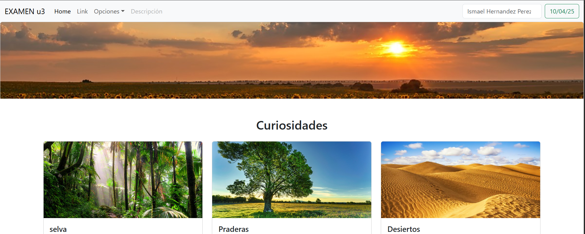
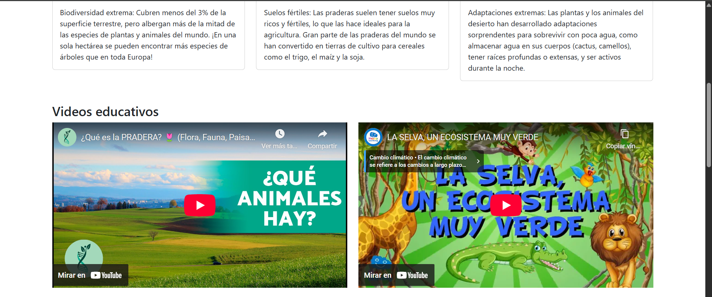

# 🌿Examen Unidad 3

Este proyecto es parte del examen de la Unidad 3 de la materia de programacion web. Es una página web hecha con **HTML**, **CSS** y **Bootstrap**, e incluye elementos como imágenes, formularios, videos, mapas y lógica con JavaScript para interactuar con el usuario.

## 📌 Contenido

- Barra de navegación responsiva
- Galería con tarjetas de paisajes
- Videos educativos sobre fauna
- Formulario para ingresar nombre y edad
- Evaluador de temperatura
- Mapa interactivo de ubicación
- Diseño adaptable con Bootstrap

## ⚙️ ¿Cómo funciona?

La página tiene varias secciones:

1. **Paisajes**: Se muestran imágenes y descripciones breves de tres paisajes.
2. **Videos**: Hay dos videos informativos sobre los paisajes.
3. **Formulario Nombre y Edad**: Al escribir tu nombre y edad, y presionar el botón, se muestra un mensaje como:  
   `"Hola, Ismael. Tienes 21 años."`
4. **Formulario Temperatura**: Escribes una temperatura y al presionar el botón, te dice si el día es:
   - Frío (menos de 15 °C)
   - Templado (15 °C a 30 °C)
   - Caluroso (más de 30 °C)
5. **Mapa**: Muestra una ubicación referencial usando Google Maps.
6. Todo es **responsivo**, adaptándose a celulares y computadoras.

## 🛠️ Tecnologías usadas

- HTML5
- CSS3
- Bootstrap 5
- JavaScript

## 🖼️ Vista previa

 
 
 

## 🌐 Página en línea

Puedes ver la página funcionando aquí 👉 [Ver proyecto desplegado](https://ismaperezh.github.io/examen_u3/)

## OBJETOS 
La captura de la investigacion esta en la carpeta investigacion.

## 🧠 Reflexión del ejercicio

### ✅ ¿Qué ventaja te dio usar Bootstrap?

Usar Bootstrap me permitió diseñar una página web responsiva y visualmente atractiva de forma rápida y sencilla. Pude aprovechar sus componentes ya listos, como tarjetas, botones y la barra de navegación, sin tener que escribir mucho CSS desde cero. También me ayudó a organizar el contenido en filas y columnas fácilmente.

### 🧩 ¿Qué aprendiste sobre los objetos en JS durante este ejercicio?

Aprendí cómo capturar datos desde formularios HTML usando `document.getElementById`, y cómo manipular esos datos con JavaScript. También entendí mejor cómo funcionan las funciones y cómo mostrar mensajes dinámicos en la página, lo que me ayudó a interactuar con el usuario de forma directa.

### 🚀 ¿Qué mejorarías si tuvieras más tiempo?

Si tuviera más tiempo, mejoraría el diseño visual agregando más estilos personalizados, integraría más contenido multimedia, validaría mejor los formularios y organizaría el código JavaScript en un archivo externo para mantener todo más limpio y modular. También me gustaría añadir animaciones y efectos visuales para que la experiencia sea más interactiva.

## ✍️ Autor
Ismael Hernández Pérez
Estudiante de la ingenieria en Tecnologías de la Información y Comunicación

