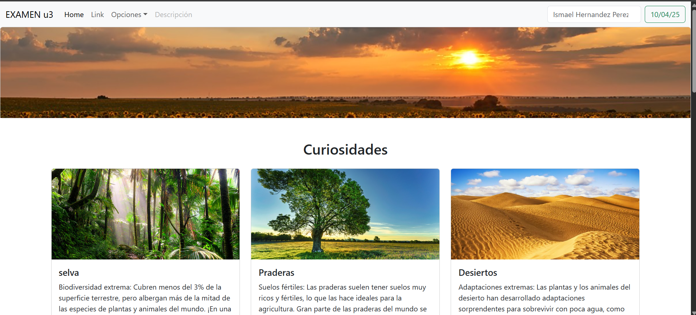

# 🌿Examen Unidad 3

Este proyecto es parte del examen de la Unidad 3 de la materia de programacion web. Es una página web hecha con **HTML**, **CSS** y **Bootstrap**, e incluye elementos como imágenes, formularios, videos, mapas y lógica con JavaScript para interactuar con el usuario.

## 📌 Contenido

- Barra de navegación responsiva
- Galería con tarjetas de paisajes
- Videos educativos sobre fauna
- Formulario para ingresar nombre y edad
- Evaluador de temperatura
- Mapa interactivo de ubicación
- Diseño adaptable con Bootstrap

## ⚙️ ¿Cómo funciona?

La página tiene varias secciones:

1. **Paisajes**: Se muestran imágenes y descripciones breves de tres paisajes.
2. **Videos**: Hay dos videos informativos sobre los paisajes.
3. **Formulario Nombre y Edad**: Al escribir tu nombre y edad, y presionar el botón, se muestra un mensaje como:  
   `"Hola, Ismael. Tienes 21 años."`
4. **Formulario Temperatura**: Escribes una temperatura y al presionar el botón, te dice si el día es:
   - Frío (menos de 15 °C)
   - Templado (15 °C a 30 °C)
   - Caluroso (más de 30 °C)
5. **Mapa**: Muestra una ubicación referencial usando Google Maps.
6. Todo es **responsivo**, adaptándose a celulares y computadoras.

## 🛠️ Tecnologías usadas

- HTML5
- CSS3
- Bootstrap 5
- JavaScript

## 🖼️ Vista previa

 

## 🚀 ¿Cómo ejecutar?

1. Clona el repositorio:
   ```bash
   git clone https://github.com/tuusuario/animales-salvajes.git
